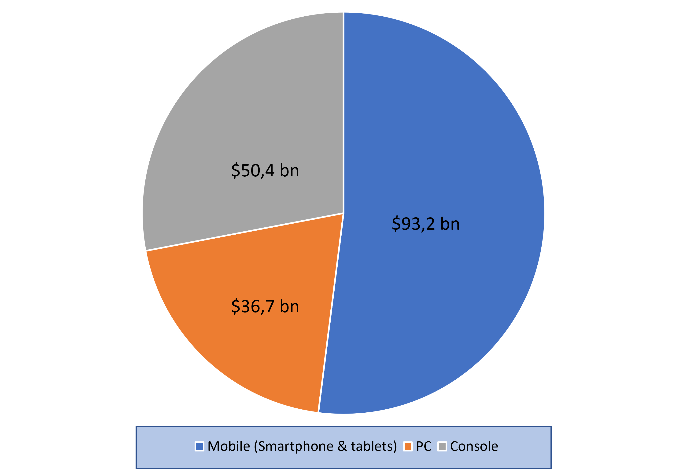
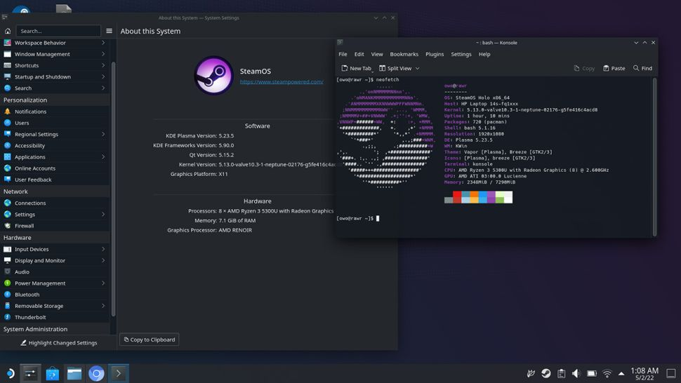

<!-- _class: invert -->

# Gaming on Linux systems <!-- fit -->
Why it's struggling to become more popular ?

---
<!-- _class: invert -->

# Brief introduction
 

---
<!-- _class: invert -->

# Preamble
## Focus on PC gaming market
---

<!-- _class: invert -->

# Global games market value 
(in 2021)

---

<!-- _class: invert -->

# A key player of the Linux gaming community
---

<!-- _class: invert -->

## Valve : a desire to create a whole new ecosystem
- SteamOS 1.0 released in 2013, based on Debian 7 (Wheezie)
- Steam Machines with SteamOS 2.0 (based on Debian 8) in 2015, a new hybrid gaming console between PC and home console (like Playstation or Xbox)
- Valve removes the Steam Machines section from the Steam client in 2018

---

<!-- _class: invert -->

# 2021, a decisive year for Valve and the Linux gaming community

---

<!-- _class: invert -->

The Steam Deck
- SteamOS 3.0 is released, based on Arch Linux
- Steam Deck is released, the new portable gaming console

---

<!-- _class: invert -->

# When the open source community gets involved
###### https://github.com/theVakhovskeIsTaken/holoiso
---

<!-- _class: invert -->

# The HoloISO project

---

<!-- _class: invert -->

# The Wine project

---

<!-- _class: invert -->

# Proton, the beginning of the revolution

---

<!-- _class: invert -->

# The ProtonDB

---

<!-- _class: invert -->

# The most famous Linux distro for gaming

---

<!-- _class: invert -->

# Why video games are originally developed for Windows ?

---

<!-- _class: invert -->

# Benchmark : Linux VS Windows