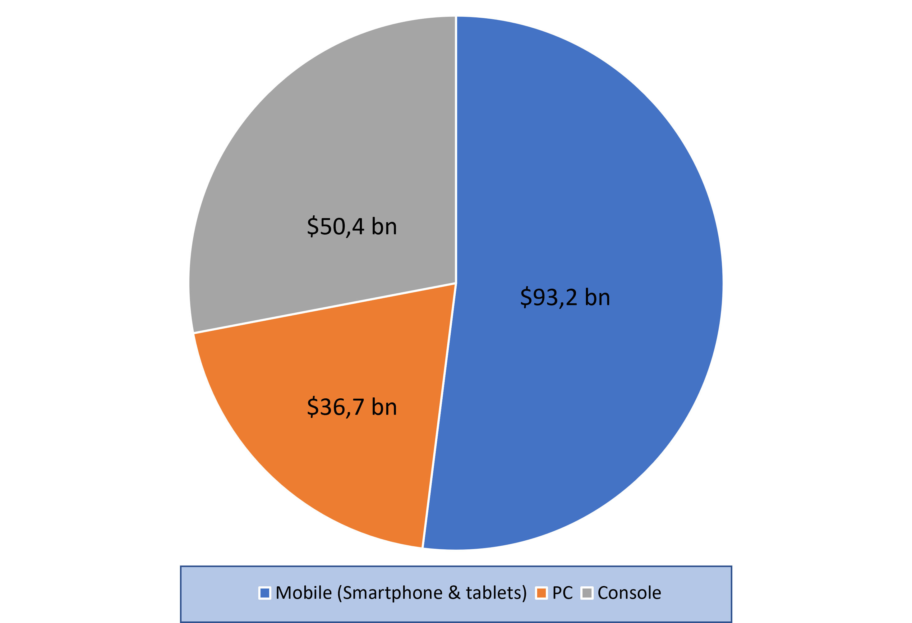

# Gaming on Linux systems, why it's struggling to become more popular ?

*This article has been written to complete the presentation and to deal in depth with the subject in detail.*

__________

## Preamble

In this article, we will focus exclusively on PC gaming market. As we can see below, it represents 30% of the global market value (here in 2021) :

*Source : Newzoo 2021 | Global Games Market Report*
 
 
We will not discuss about consoles like Xbox, PS4/5, Nintendo Switch or little browser games like the chrome dino. Except the Steam Deck (we will see why), Linux systems have very rarely been invited into the gaming environment natively or promoted at big gamig events. This is one of the main reasons why it's still a domain of enthusiasts, already familiar with Linux environments.

## One of the key players in the development of gaming on Linux systems

For almost 10 years, Valve has always shown interest in the Linux gaming community. In 2013, at the LinuxCon, the PDG of Valve Gabe Newell presented SteamOS 1.0, a Linux distribution based on a fork of Debian 7 (Wheezie) designed to become the reference operating system for the gaming on PC. Even Linus Torvalds praised the idea of SteamOS, saying that it would force other development studios to take Linux seriously. Especially if game developers start to boycott Windows.

Valve intended to make SteamOS a viable alternative of the Windows systems and to give a whole new ecosystem for the gamers with a Steam account. In 2015, Valve announced Steam Machines with the new SteamOS 2.0 (based on Debian 8), a new hybrid gaming console between PC and home console (like Playstation or Xbox). The goal of theses consoles was to attract both the PC gamers abd the home console gamers. But it was a huge commercial failure. Currently, at the time of writing, when you enter the words "Steam machines", you will see a lot articles talking about the death of theses consoles. Of course, the Steam Machines are no longer available for sale now.

### A new hope for Valve and the Linux gaming community

2021 was a crucial year for Linux gaming and even for Gaming in general. In fact, Valve announces the release of the Steam Deck console in July of that year. Due to semiconductor shortage, the console was only available after a few months (at the beginning of 2022 in Europe for example) which did not prevent it from being a real success for the players.

At the same time as the release of the console, Valve also released SteamOS 3.0, based on Arch Linux this time, with a KDE environment. This new version of SteamOS is a real success for the Linux community and it is the first time that a major Linux distribution is used as the base of a gaming console designed for the general public. This is a real step forward for the Linux gaming community.

### When the open source community gets involved 

Unlike SteamOS 2.0 and SteamOS 1.0 previously, this third version isn't directly available on the Steam website. The operating system is preinstalled on the Steam Deck console but you can't download (for the moment at least) the ISO file.

However, some developers has already managed to get an ISO file and to install it on a PC. The installation is not as simple as on SteamOS 2.0 but it is still possible. Of course, it's a customed version of SteamOS 3.0 and it's not recommended for beginners. But it's a good way to test the operating system and to see if it's possible to install it on your PC. The project is named HoloISO and it's available on Github via this link  :

https://github.com/theVakhovskeIsTaken/holoiso

As they say, it's not an official release and it's not supported by Valve. But they want to make as close as possible the gaming experience that you can find on the Steam Deck console. So, if you want to try it, you can follow the instructions on the Github page.

## The Wine project 

Nowadays, I think you noticed that PC video games are mainly developed for Windows systems and we will know why in the final section. And sometimes it can be frustrating that you have to install a Windows dual boot only for this purpose. Why can't we play with our favorites games on a Linux distribution for god sake ?

This is where the Wine project can be helpful. It's a compatibility layer that allows you to run Windows applications on Linux systems. Wine (**W**ine **i**s **n**ot an **e**mulator) is a free and open source software that translates Windows API calls into POSIX calls on-the-fly. It's more efficient than a virtual machine and more convenient than a dual boot.

The idea to run Windows software on Linux systems is not new. In fact, it's been around for nearly 30 years. The Wine projet was born in 1993 but it will be necessary to wait until 2008 before having a stable version. Since then, the Wine project has been constantly evolving and it's still maintained by a large community of developers. You can check the latest news on the official <a href="https://www.winehq.org/">website</a>.

## Proton, the beginning of the revolution 

Wine is indeed a powerful solution but it was not originally designed for gaming but running Windows applications on Linux systems in general. So, it's not really optimized for gaming, even more with the complexity of the latests games.

In 2018, Valve (yes again) released the first version of the software Proton, a fork of Wine that is specifically designed for gaming. It's alson known as Steam Play on the Steam client. It's a huge game changer (lol) for the Linux gaming community and according to me it's a major breakthrough for the Linux gaming ecosystem in general. 

Proton is directly integrated into SteamOS 3.0 (and in the console as well) but it's also available on many other Linux distributions. As we said before, Proton is a fork of Wine but with a lot of improvements. It embodies several components like a customed version of DXVK (Vulkan-based translation layer for Direct3D 9/10/11), VKD3D (Vulkan-based translation layer for Direct3D 12) and a customed version of FAudio (a library that allows you to play audio files). 
They only use Direct3D from DirectX and not the whole DirectX API. So, it's not a full implementation of DirectX but it's not a problem because Proton uses Vulkan wich is an open source and cross-platform API for 3D graphics and OpenGL.

The main purpose of the Proton software is to facilitate the integration of the game for developers on Linux platforms. They don't have to rebuild an entire game from scratch to make it compatible with Linux systems. They "just" have to make it compatible with Proton and the game will be playale on the Linux Steam client. Of course, it's not a magic solution and it's not a full replacement for a native Linux version of the game. But it's a good way to encourage developers to do so and for Valve to promote its new console of course.

### The ProtonDB 

The ProtonDB is a website that allows you to check if a game is compatible with Proton. It's a huge database that is updated regularly and a color code is used to indicate the level of compatibility of the game. In other words, it's a good way to know if a game is fully playable on Linux systems or just partially. You can check the ProtonDB via this link :

https://www.protondb.com/

## Most famous Linux distro for gaming 

There are a few Linux distributions that are particularly suitable for gaming. We will see the most famous ones in this section.

- SteamOS
    - Fork of Debian based on 8.x "Jessie"
    - Not actively maintained and outdated

- Pop!_OS
    - Based on Ubuntu LTS, made by System76
    - Suited for hybrid graphics computers
    - Version with Nvidia drivers directly available

- Garuda Linux
    - Based on Arch Linux
    - Several GUI applications to easily manage the system
    - Garuda Gamer application (GUI tool to install gaming-related tools from one place)

- DraugerOS
    - Based on Ubuntu LTS
    - Customized Linux Kernel to reduced the latency
    - Claims to support most Xbox and Xbox360 controllers and some PlayStation controllers as well

- Retropie
    - Based on Raspbian
    - Emulator for retro games
    - Optimized for Raspberry Pi (but works on other computers as well)

## Why video games are originally developed for Windows ?

Of course, there are some reasons why video games are originally developed for Windows systems. The first one is the market shares. Windows is the most used operating system in the world and it's the same for PC gaming. According to the latest data from Statcounter and Statista, Windows is the most used operating system for gaming with ~75% of the market shares. Linux is only at ~2.2% and MacOS at ~15%. So, it's not really surprising that most of the games are developed for Windows systems.

The second one that DRM are also orignally developed for Windows platforms. We can mention the famous Easy anticheat that is used by many games. According to <a href="https://dev.epicgames.com/en-US/news/epic-online-services-launches-anti-cheat-support-for-linux-mac-and-steam-deck">Epic Games</a>, the software is available on Linux systems since September 2021 only ! So there is still a huge delay in terms of compatibility with Linux systems for PC video games.

Finally, the third reason is the complexity of the latests games. As we said before, the latests games are more and more complex and it's not easy to make them compatible with Linux systems when during manny years they were only developed for Windows systems. But to end this article optimistically, I think that the situation will change in the future and we will see more and more games developed for Linux systems, especially since the Steam Deck was released. Wait and see !

## Appendix - Sources and References

https://www.01net.com/actualites/pour-linus-torvalds-steam-os-aidera-vraiment-linux-sur-les-pc-de-bureau-606188.html

https://fr.wikipedia.org/wiki/SteamOS

https://steamcommunity.com/groups/steamuniverse/discussions/1/648814395741989999/

https://www.futura-sciences.com/tech/definitions/informatique-steamos-19992/

https://www.phonandroid.com/steam-deck-prix-date-de-sortie-fiche-technique-jeux-tout-savoir-sur-la-console-portable-de-valve.html

https://www.winehq.org/

https://github.com/ValveSoftware/Proton

https://www.trustedreviews.com/explainer/what-is-vulkan-2946841

https://www.protondb.com/

https://gs.statcounter.com/browser-market-share/desktop/worldwide

https://www.statista.com/statistics/268237/global-market-share-held-by-operating-systems-since-2009/